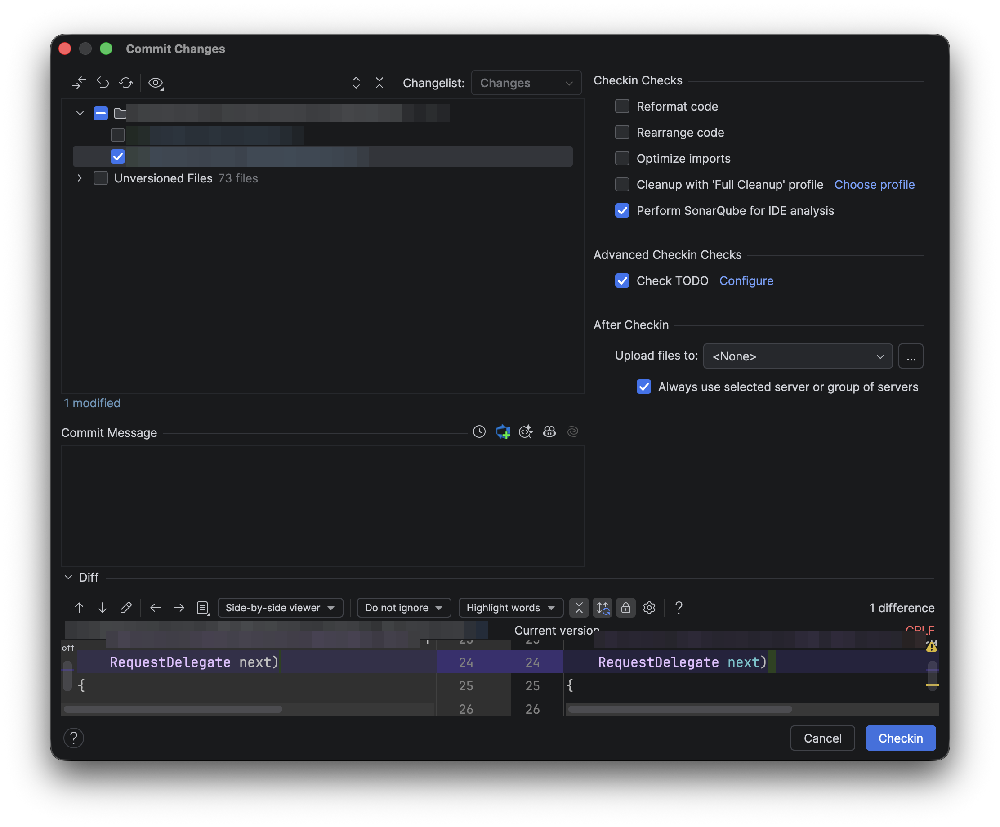
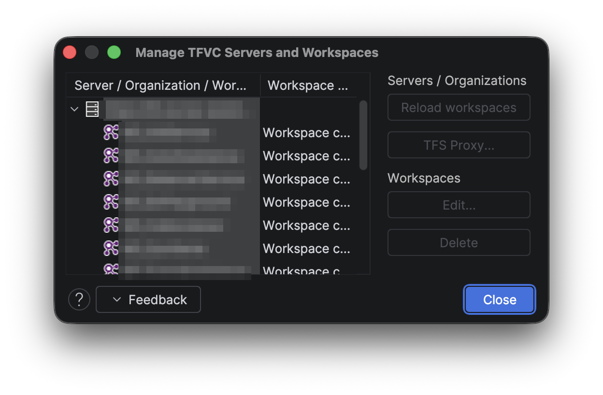

#  Azure DevOps plugin for JetBrains IDEs

[](https://github.com/Bayrakovsky/azure-devops-intellij/actions/workflows/ci.yml)
[](LICENSE.txt)
[](#requirements)
[](https://github.com/Bayrakovsky/azure-devops-intellij/releases/latest)

Work with **Git** and **TFVC** repositories hosted on **Azure DevOps Services** or **Team Foundation
Server 2015+** from IntelliJ-based IDEs — including **Rider**, IntelliJ IDEA, and Android Studio.

This is a **community fork** of the unmaintained
[Microsoft/azure-devops-intellij](https://github.com/microsoft/azure-devops-intellij) plugin,
revived and migrated to the IntelliJ Platform **2026.1**. The primary use case driving this fork is
**TFVC support in Rider**.

| TFVC check-in | Manage TFVC servers and workspaces |
|---|---|
|  |  |

---

## Requirements

- An IntelliJ Platform IDE **2026.1 or later**: Rider, IntelliJ IDEA (Community or Ultimate), Android Studio, etc.
- An **Azure DevOps Services** organization or **Team Foundation Server 2015+** instance.
- For **TFVC** only: the [Team Explorer Everywhere command-line client (TEE CLC)](https://github.com/microsoft/team-explorer-everywhere/releases)
  unpacked somewhere on your machine. The plugin drives the `tf` executable and also ships its own
  reactive TFVC backend (based on the TFS Java SDK) — no extra setup needed for the latter.

Supported on Linux, macOS, and Windows.

## Features

- Checkout Git and TFVC repositories from Azure DevOps / TFS directly from the welcome screen.
- Authenticate with Azure DevOps Services and on-premises TFS (including personal access tokens).
- **Git**: create pull requests, view pull requests, create branches, import projects into Azure DevOps.
- **TFVC**: local changes detection, check-in, rollback (undo), history, diff, rename/move tracking,
  merge-conflict resolution, workspace management, `.tfignore` support.
- Browse and associate **work items** with commits and check-ins.
- Build status indication for the current branch.
- Proxy support via the IDE-wide HTTP proxy settings.

## Installation

**From JetBrains Marketplace** (recommended): in your IDE, open **Settings → Plugins →
Marketplace**, search for **Azure DevOps**, and install the plugin by *Stanislav Bayrakovskiy*.

**From a GitHub release:**

1. Download the latest `azure-devops-<version>.zip` from the
   [Releases](https://github.com/Bayrakovsky/azure-devops-intellij/releases) page.
   **Do not unzip it.**
2. In your IDE: **Settings → Plugins → ⚙ → Install Plugin from Disk…** and select the zip.
3. Restart the IDE.

## TFVC setup

1. Install the [TEE CLC](https://github.com/microsoft/team-explorer-everywhere/releases) and accept
   its EULA once (`tf eula`).
2. In the IDE: **Settings → Version Control → TFVC**, set the path to the `tf` executable
   (e.g. `/opt/TEE-CLC-14.135.3/tf` or `C:\TEE-CLC-14.135.3\tf.cmd`) and press **Test**.
3. Open a directory that is mapped in a TFVC workspace — the plugin picks up the workspace mappings
   automatically, and local changes appear in the Commit / Pending Changes view.

## Build from source

```bash
git clone https://github.com/Bayrakovsky/azure-devops-intellij.git
cd azure-devops-intellij
./gradlew :plugin:buildPlugin
```

The plugin zip lands in `plugin/build/distributions/`. You do not need to install a JDK up front:
the build uses the Gradle toolchain mechanism and downloads JDK 21 automatically. To run a sandbox
IDE with the plugin installed, use `./gradlew :plugin:runIde`.

## Contributing

Contributions are welcome — see [CONTRIBUTING.md](CONTRIBUTING.md) for the project layout, build
instructions, and code style. Notable changes are tracked in [CHANGELOG.md](CHANGELOG.md), and all
project spaces follow the [Code of Conduct](CODE_OF_CONDUCT.md).

## Security

Please report vulnerabilities privately — see [SECURITY.md](SECURITY.md). Do not open public issues
for security problems.

## License

[MIT](LICENSE.txt). Original work Copyright (c) Microsoft Corporation; modifications Copyright (c)
Stanislav Bayrakovskiy. This fork is not affiliated with or endorsed by Microsoft.
